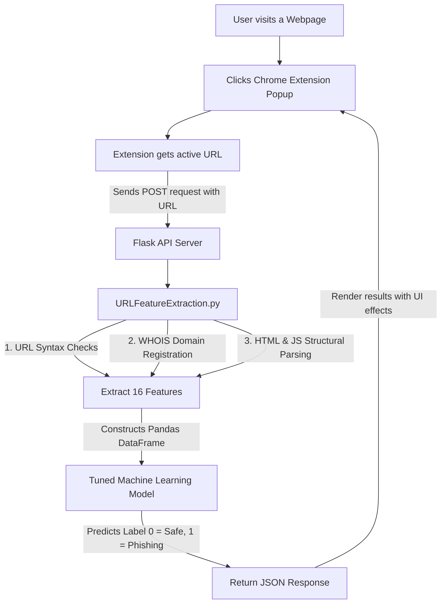

# Phishing Detection Chrome Extension & AI Server

An AI-powered web security system that detects phishing websites in real-time. The project consists of a modern, lightweight Google Chrome Extension that communicates with a Flask-based backend server. The backend runs feature extraction on the scanned URL and queries a tuned Machine Learning classifier to output a prediction ("Safe" vs. "Phishing").

---

## 🏗️ Project Architecture



---

## ⚡ Key Features & URL Parsing

When a URL is scanned, the backend extracts **16 key features** categorized into three main categories:

1. **Address Bar (Syntax) Features**:
   - Presence of an IP address in the domain
   - Presence of `@` symbols (used to redirect and ignore preceding text)
   - URL length check (URLs $\ge$ 54 characters classified as higher risk)
   - Path depth (count of subfolders)
   - Redirection symbol `//` locations
   - Existence of `http/https` inside the domain name (phishing spoofing)
   - Use of common URL shortening services (e.g., bit.ly, tinyurl)
   - Prefix/suffix dashes `-` in the domain name

2. **Domain-Based Features**:
   - **DNS Record**: Presence/availability of records in the DNS registrar.
   - **Web Traffic**: Global popularity rating (falls back to a default value since the Alexa API decommissioning).
   - **Domain Age**: Age calculated between creation and expiration dates (minimum 12 months for legitimate sites).
   - **Domain End**: Remaining duration before domain expiry.

3. **HTML & JavaScript Features**:
   - **IFrame Redirection**: Invisible frames used to overlay content.
   - **Status Bar Customization**: Detection of `onmouseover` event overrides.
   - **Disabling Right Click**: Prevention of users viewing page source code.
   - **Website Forwarding**: Number of times the response has redirected (limit of $\le 2$ for legitimate sites).

---

## 📊 Machine Learning Models & Dataset

The models are trained on a balanced dataset of **10,000 URLs** (5,000 legitimate URLs sourced from Alexa rankings and 5,000 phishing URLs sourced from active PhishTank feeds) using 16 extracted feature columns.

We optimized and trained two classifiers:
* **Tuned Random Forest Classifier** (500 Estimators): **85.95% Accuracy** *(Primary model used in the API)*
* **Tuned XGBoost Classifier** (`n_estimators=500`, `max_depth=8`): **85.70% Accuracy**

---

## 🚀 Setup and Run Guide

### 1. Run the Flask Backend
Make sure you have Python 3.8+ installed.

1. Navigate to the project root folder:
   ```bash
   cd Phishing-detection-extension-main
   ```
2. Create and activate a virtual environment:
   ```bash
   python -m venv venv
   # On Windows:
   venv\Scripts\activate
   # On macOS/Linux:
   source venv/bin/activate
   ```
3. Install the dependencies:
   ```bash
   pip install -r requirements.txt
   ```
4. Start the Flask server:
   ```bash
   python app.py
   ```
   The API will now be running locally at `http://127.0.0.1:5000/`.

---

### 2. Load the Google Chrome Extension

1. Open Google Chrome and navigate to `chrome://extensions/`.
2. Turn on **Developer mode** using the toggle switch in the top-right corner.
3. Click the **Load unpacked** button in the top-left corner.
4. Select the `Phishing_detection_app/chrome_extension` folder inside this project.
5. The extension "Phishing Detector" is now loaded! Pin it to your Chrome toolbar.
6. Open any website in your browser, click the extension icon, and select **Scan Current Page**.

---

## 🌐 Production Deployment

To host the API server in production (e.g., on [Render](https://render.com/) or Heroku):

1. Deploy the backend using the included [`render.yaml`](file:///c:/Users/saipr/OneDrive/Desktop/Phishing-detection-extension-main/Phishing-detection-extension-main/render.yaml) blueprint or by binding the server to a Gunicorn start command:
   ```bash
   gunicorn app:app
   ```
2. Update the `API_URL` variable inside the Chrome Extension's [`popup.js`](file:///c:/Users/saipr/OneDrive/Desktop/Phishing-detection-extension-main/Phishing-detection-extension-main/Phishing_detection_app/chrome_extension/popup.js):
   ```javascript
   // Replace localhost with your production server URL
   const API_URL = 'https://your-phishing-detection-api.onrender.com/predict';
   ```

---

## 📁 File Structure

* [`app.py`](file:///c:/Users/saipr/OneDrive/Desktop/Phishing-detection-extension-main/Phishing-detection-extension-main/app.py) - Flask web API exposing `/predict` endpoint.
* [`URLFeatureExtraction.py`](file:///c:/Users/saipr/OneDrive/Desktop/Phishing-detection-extension-main/Phishing-detection-extension-main/URLFeatureExtraction.py) - Main feature extraction module parsing syntax, WHOIS, and page structures.
* [`train_model.py`](file:///c:/Users/saipr/OneDrive/Desktop/Phishing-detection-extension-main/Phishing-detection-extension-main/train_model.py) - Machine learning pipeline training the RF and XGBoost classifiers.
* [`xg_boost.pkl`](file:///c:/Users/saipr/OneDrive/Desktop/Phishing-detection-extension-main/Phishing-detection-extension-main/xg_boost.pkl) - Saved high-accuracy Random Forest classifier loaded by the Flask API.
* [`Phishing_detection_app/chrome_extension/`](file:///c:/Users/saipr/OneDrive/Desktop/Phishing-detection-extension-main/Phishing-detection-extension-main/Phishing_detection_app/chrome_extension/) - Chrome Extension assets (`manifest.json`, `popup.html`, `popup.js`).
* [`DataFiles/`](file:///c:/Users/saipr/OneDrive/Desktop/Phishing-detection-extension-main/Phishing-detection-extension-main/DataFiles/) - Dataset storage containing CSV files (legitimate list, phishing list, and the 10,000-row combined training set).
